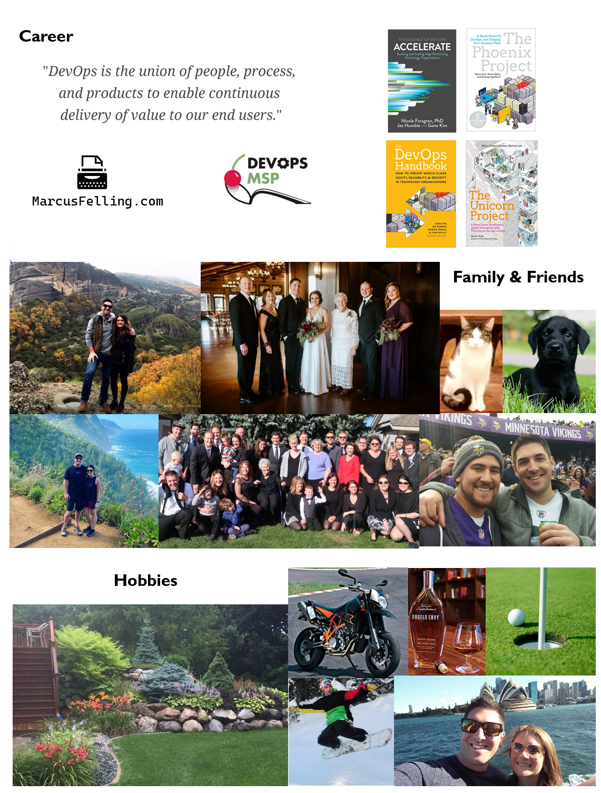

Hello  Welcome to my GitHub Profile.

- 🔭 I’m currently working on ...

- 💬 Ask me about ...

**Subjects**: Source control (Git, TFVC), Continuous Integration (CI) and Continuous Delivery (CD), Infrastructure as Code (IaC), Manual and Automated Testing, Agile software development (Scrum, Kanban), and software developer productivity.

**Tech**: Azure DevOps, Azure Pipelines, Azure Boards, Azure Test Plans, Azure Artifacts, PowerShell, .NET, MSBuild, Visual Studio, Azure, AWS, NuGet, Octopus Deploy, Terraform, GitHub Actions, IIS, SQL Server, SonarQube

